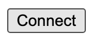

# html-js-ethers-connect

A small html file to show how to connect with metamask from the front-end. This is a minimalistic example what you can find in the [metamask docs](https://docs.metamask.io/guide/create-dapp.html#basic-action-part-1).

# Requirements

- [git](https://git-scm.com/book/en/v2/Getting-Started-Installing-Git)
  - You'll know you've installed it right if you can run:
    - `git --version`
- [Metamask](https://metamask.io/)
  - This is a browser extension that lets you interact with the blockchain.

# Quickstart

1. Clone the repo, install dependencies, and create the build.

```
git clone https://github.com/PatrickAlphaC/front-end-metamask-button
```

2. Serve the file

Open index.html in a browser with Metamask plugin installed


You should see a small button that says "connect".



Hit it, and you should see metamask pop up.

# Execute a transaction

If you want to execute a transaction follow this:

Make sure you have the following installed:

1. You'll need to open up a second terminal and run:

```
git clone https://github.com/PatrickAlphaC/hardhat-simple-storage
cd hardhat-simple-storage
yarn
yarn hardhat node
```

This will deploy a sample contract and start a local hardhat blockchain.

2. Update your `index.js` with the new contract address.

In your `index.js` file, update the variable `contractAddress` with the address of the deployed contract. You'll see it near the top of the hardhat output.

3. Rebuild


Reload page in browser


4. Connect your [metamask](https://metamask.io/) to your local hardhat blockchain.

> **PLEASE USE A METAMASK ACCOUNT THAT ISNT ASSOCIATED WITH ANY REAL MONEY.**
> I usually use a few different browser profiles to separate my metamasks easily.

In the output of the above command, take one of the private key accounts and [import it into your metamask.](https://metamask.zendesk.com/hc/en-us/articles/360015489331-How-to-import-an-Account)

Additionally, add your localhost with chainid 31337 to your metamask.

5. Reserve the front end with `yarn http-server`, and then hit the `Execute` button after connecting

# Thank you!

If you appreciated this, feel free to follow me or donate!

ETH/Polygon/Avalanche/etc Address: 0x9680201d9c93d65a3603d2088d125e955c73BD65

[](https://twitter.com/PatrickAlphaC)
[](https://www.youtube.com/channel/UCn-3f8tw_E1jZvhuHatROwA)
[](https://www.linkedin.com/in/patrickalphac/)
[](https://medium.com/@patrick.collins_58673/)
